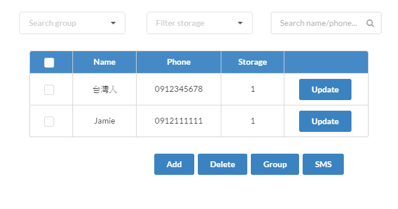

# Title

## Sub title

### Example

Six of the students who received all 15 of the15 possible points for the assignment agreed to share their summaries.  Their summaries are presented here "as is."  Students did not revise after they received feedback. Consider these examples models of good student papers.  The grader's comments that were penciled in the body of the paper are not included. However, the grader's final handwritten comment was added at the bottom of each example. 

Another line or paragraph.

## Images

## List 1

- a
- b
- c

## List 2

1. a
2. b
3. c

